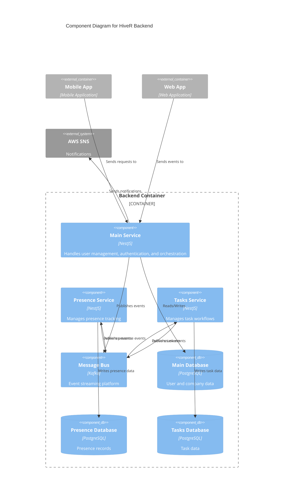

# Component Diagram

The component diagram zooms into the backend container to show the internal structure and how components interact.

## Diagram

## Backend Components

### Main Service
**Technology**: NestJS

The main service is responsible for:
- User authentication and authorization
- Core business logic orchestration
- Event publishing to the message bus
- Database operations for user and company data

**Connections**:
- Writes to Main Database
- Publishes events to the Message Bus
- Receives requests from the Web App

### Presence Microservice
**Technology**: NestJS

Specialized service for presence tracking:
- Processes presence check-in/check-out events
- Maintains presence history
- Generates presence reports

**Connections**:
- Subscribes to events from the Message Bus
- Writes presence data to Presence Database

### Tasks Microservice
**Technology**: NestJS

Dedicated service for task management:
- Creates and updates tasks
- Assigns tasks to employees
- Tracks task completion status

**Connections**:
- Subscribes to events from the Message Bus
- Writes task data to Tasks Database

### Message Bus (Kafka)
**Technology**: Apache Kafka

Central event bus providing:
- Asynchronous communication between services
- Event persistence and replay capability
- Scalable message distribution

**Event Types**:
- User events (created, updated)
- Presence events (check-in, check-out)
- Task events (created, assigned, completed)
- Notification events

### Databases

Each service has its own PostgreSQL database following the database-per-service pattern:

**Main Database**: Users, companies, authentication data

**Presence Database**: Check-in records, presence history, schedules

**Tasks Database**: Tasks, assignments, status tracking

## Component Interaction Flow

### Example: Employee Check-In

1. Employee uses mobile app to check in
2. Request goes to Main Service
3. Main Service validates and publishes `presence.checkin` event to Kafka
4. Presence Microservice consumes the event
5. Presence data is stored in Presence Database
6. Notification event is published to AWS SNS
7. Employee receives confirmation notification

### Example: Task Assignment

1. Manager creates task in web app
2. Web app sends request to Main Service
3. Main Service publishes `task.created` event to Kafka
4. Tasks Microservice consumes the event
5. Task is stored in Tasks Database
6. Notification event triggers email to assigned employee

---

Return to: [Architecture Overview](overview.md)
