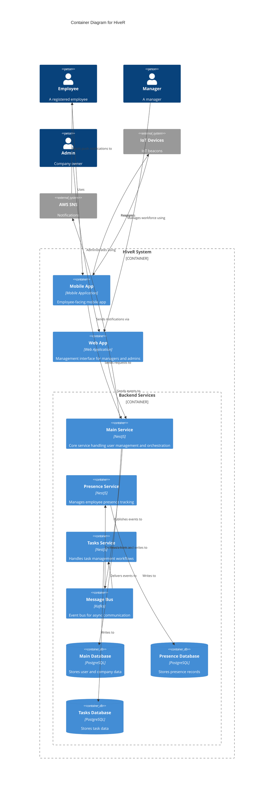

# Container Diagram

The container diagram shows the high-level technology choices and how the major pieces of the HiveR system communicate.

## Diagram

## Containers

### Backend
The backend is composed of multiple microservices and shared infrastructure:

- **Main Service** (NestJS): Core service handling user management and orchestration
- **Presence Microservice** (NestJS): Manages employee presence tracking
- **Tasks Microservice** (NestJS): Handles task management workflows
- **Message Bus** (Kafka): Event bus for asynchronous communication
- **Main Database** (PostgreSQL): Stores user data and core system information
- **Presence Database** (PostgreSQL): Stores presence records
- **Tasks Database** (PostgreSQL): Stores task data

### Mobile App
Employee-facing mobile application that:
- Connects to the backend services
- Interacts with IoT devices
- Receives push notifications

### Web App
Browser-based application for managers and administrators that:
- Provides management interface
- Connects to the main backend service
- Sends events through the system

## Communication Patterns

### Synchronous
- Mobile app → Backend (REST/GraphQL)
- Web app → Main Service (REST/GraphQL)

### Asynchronous (Event-Driven)
- Main Service → Message Bus → Microservices
- Microservices → Message Bus (event publishing)
- Backend → AWS SNS (notifications)

## Data Flow

1. Web app sends events to the Main Service
2. Main Service publishes events to the Kafka message bus
3. Microservices (Presence, Tasks) subscribe to relevant events
4. Each microservice processes events and updates its own database
5. Notification events are sent to AWS SNS
6. AWS SNS delivers emails and push notifications to users

---

Next: [Component Diagram](components.md)
