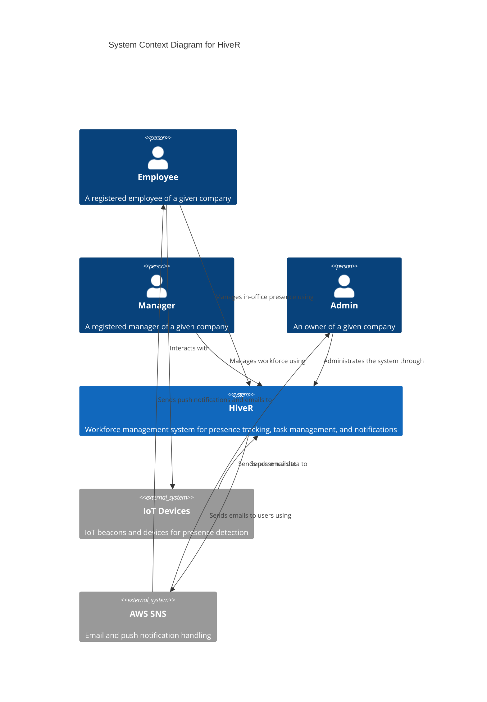

# System Context Diagram

The system context diagram shows HiveR and how it fits in the larger ecosystem, including external systems and user types.

## Diagram

## System Overview

### HiveR System

The core HiveR system provides workforce management capabilities including presence tracking, task management, and notifications.

### External Systems

**IoT Devices**
- Interact with the mobile app
- Used for automated presence check-ins
- Respond to prompts from the mobile application

**AWS SNS**
- Handles email and push notification delivery
- Sends notifications to employees and administrators
- Integrated with the main HiveR system

## Actors

### Employee
A registered employee of a company who:
- Uses the mobile app to manage in-office presence
- Receives push notifications and emails
- Interacts with IoT devices for check-ins

### Manager
A registered manager who:
- Uses the web application to manage workforce
- Monitors employee presence and tasks
- Receives notifications about team activities

### Admin
The company owner who:
- Administrates the system through the web application
- Has full access to all system features
- Receives administrative emails and alerts

## Key Relationships

- Employees use the mobile app to interact with the system
- Managers and admins use the web application for management tasks
- The mobile app communicates with IoT devices
- HiveR sends notifications via AWS SNS
- AWS SNS delivers emails and push notifications to users

---

Next: [Container Diagram](containers.md)
